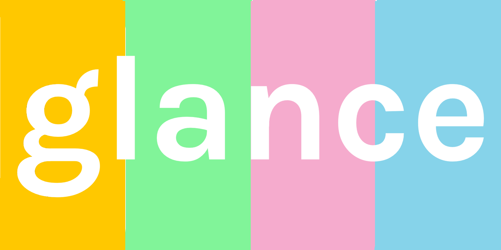
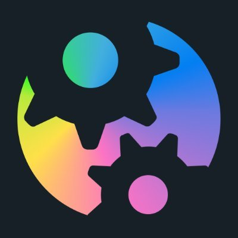
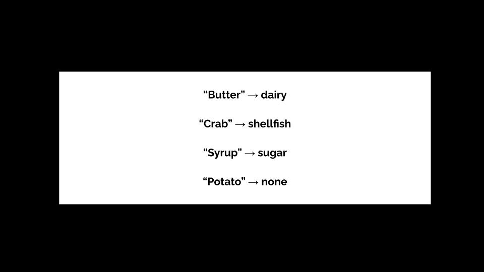
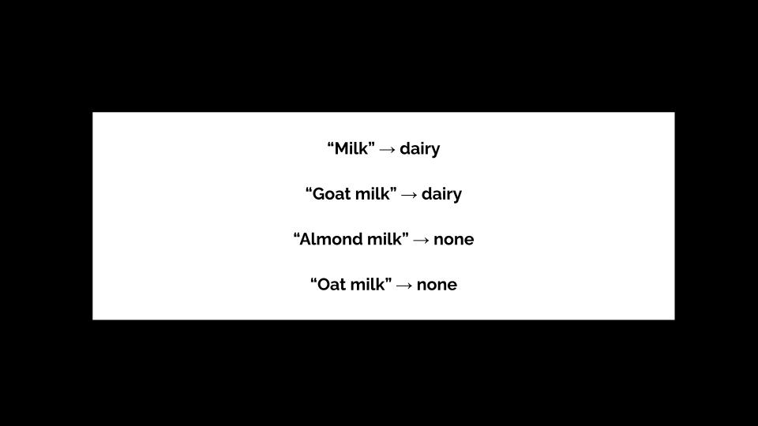
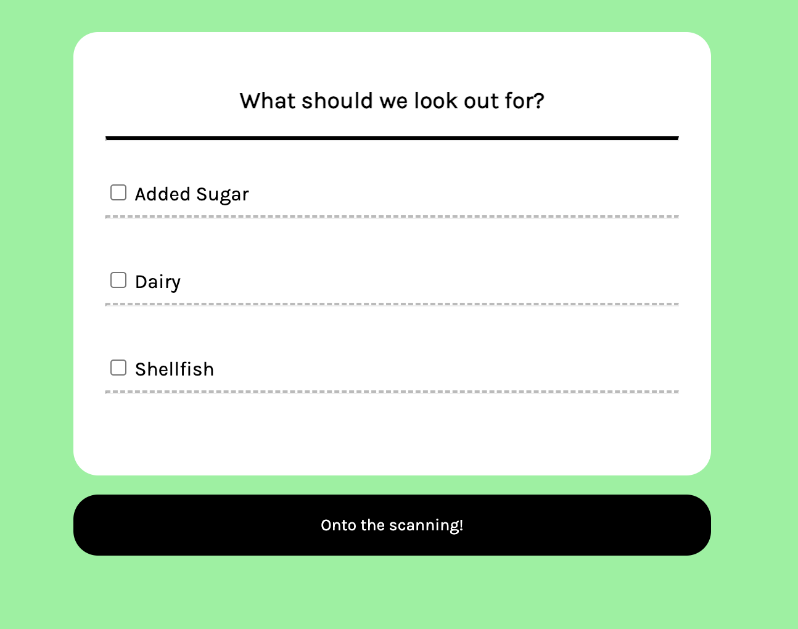
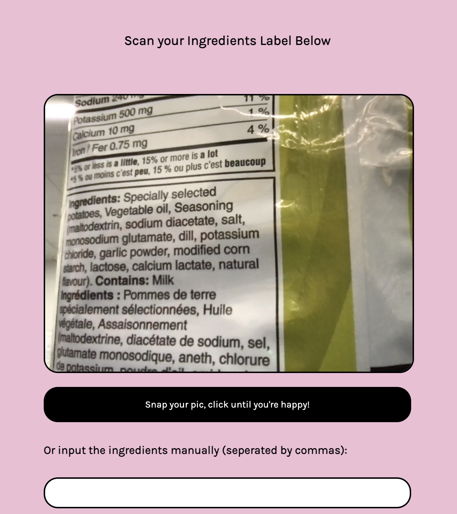
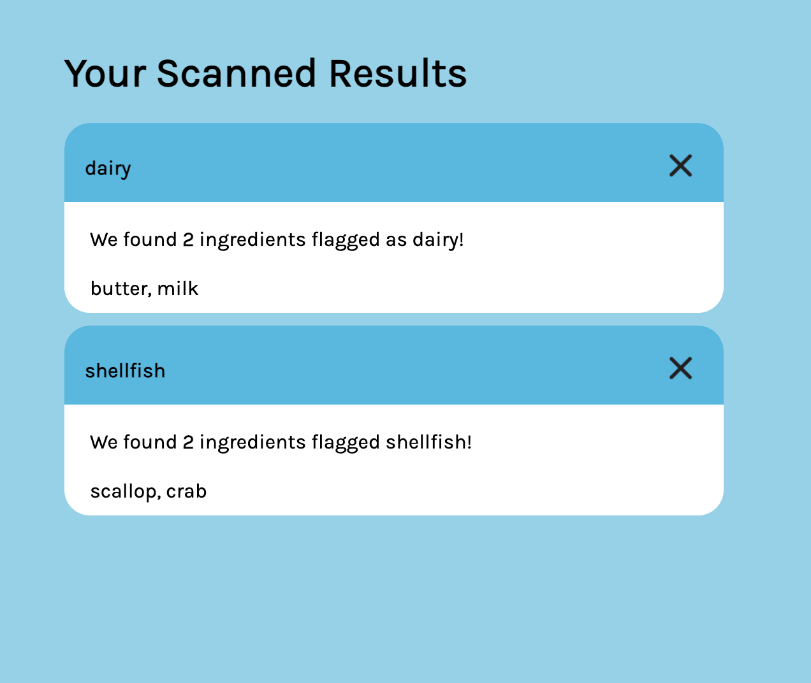

# Glance

<p align="center">
  
  
</p>

## About

Glance is an ingredient scanner that leverages the Cohere NLP word classification API to see if your food has something you don't want in it. Say goodbye to reading labels and have confidence at a glance!

Glance allows users to select an ingredient (like shellfish) or category of food (like dairy) to look for in the picture of the ingredient list they take on our web app. We also provide an option for users to manually enter ingredients they're unsure. The list of ingredients is then checked against the users selected preferences and a table of results ais provided letting the user know at a glance if the food contains any of their flagged ingredients or categories.

This project was developed by Barrett Arbour and Brandon Ye at Hack the North 2022, and was built with React and Node.js. It utilizes Cohere's NLP word classification API on a model trained to classify words into different ingredient catagories.

<p align="center">
  
  
</p>

<details>
  <summary>Screenshots</summary>
  
  
  
</details>

## Usage

To start up the app, clone the repo and run the following commands:

```
node server
```

```
cd client
npm start
```

## Learn More

https://devpost.com/software/glance-vur5we
